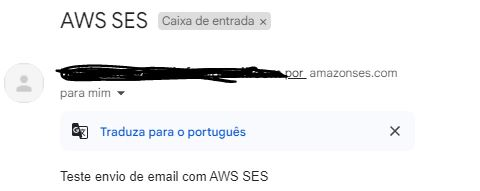

<h1> API de envio de e-mails </h1>
Api desenvolvida como parte de resolução de desafio back-end Uber  
https://github.com/uber-archive/coding-challenge-tools/blob/master/coding_challenge.md
  

<h2>Proposta</h2>
Desenvolver Serviço de envio de e-mails utilizando o serviço Amazon SES.
  

<h2>Requisitos Técnicos</h2>
Arquitetura RESTful com entradas e saídas em JSON  
Testes  
Documentação  
Implantação Cloud 
  

<h2>O que foi desenvolvido</h2>
Foi desenvolvido um serviço de envio de emails que recebe os dados de um cliente como destino, assunto e mensagem e envia estes dados ao seu destino.
A aplicação foi implantada em uma instância EC2 mas por questões de custos, o serviço esta offline.

Foi escolhido o nivel Pleno para o desafio técnico.  
O Java na versão 17 foi escolhido como linguagem.  
Utilizado padrão Restful para o desenvolvimento do serviço.  
Dentro do requisito tecnico, foi escolhido a trilha de back-end com um minimo de front-end sendo a documentação via API Docs.

<h2>Como testar</h2>
<h4>Pré-requisitos</h4>
É necessario possuir um registro de email configurado no Amazon SES para envio de emails.  
É necessario também chaves de acessos geradas pelo serviço Amazon SES configuradas em application.properties  

<h4>Iniciando o App</h4>
1. clonar o repositorio  
2. importar o projeto em alguma IDE de preferencia ou gerar versão da aplicação com o maven: mvn package  
3. executar o jar da aplicação com o comando: java -jar target/email-service-0.0.1-SNAPSHOT.jar  
4. com aplicativos clientes como postman ou insomnia, criar nova requisição POST para o endpoint dominio_local:8080/api/email  
Obs: ver exemplo de requisição com API Docs em: http://localhost:8080/swagger-ui.html

 

<h4>Resultados</h4>
Requisição Postman:  

Email recebido:  

  
<h2>Padrão de Arquitetura</h2>
MVC

 

<h2>Testes Realizados</h2>
Testes de unidade do Controller - Testes de unidade no Endpoint

 

Executar o comando: mvn test 

 
<h2>Endpoint:</h2>
http://localhost:8080/api/email

<h2>Tecnologias Aplicadas</h2>

Java 17

Apache Maven

Spring Boot

Spring IoC

Swagger

Devtools

Apache Tomcat

IDE Spring Tool Suite

MockMvc

AssertJ

Acesso Open API doc:
1. http://localhost:8080/swagger-ui.html
2. http://localhost:8080/v3/api-docs
 

 
  

